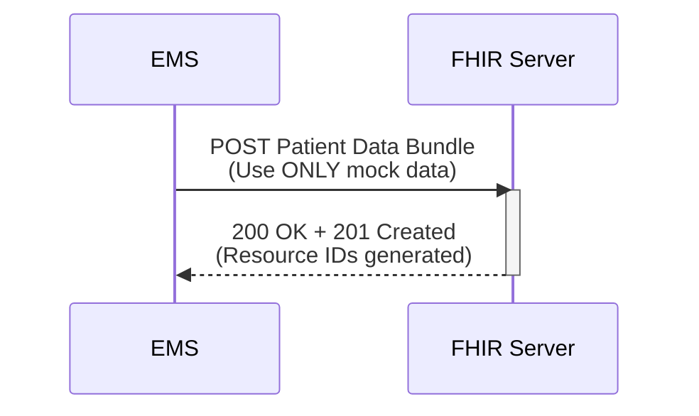

# Use Case #1

A road safety incident happens and someone on the road needs medical attention. Emergency medical services were called to the scene to assess the patient and bring him to the facility. A patient care form was filled up and must be submitted to the electronic shared health records. Use Case #1 shall be the act of submitting the road safety case bundle from the EMS to the SHR endpoint.

The PH Road Safety FHIR® Connectathon 2025 will use the **draft** [PH Road Safety FHIR Implementation Guide](https://build.fhir.org/ig/UPM-NTHC/PH-RoadSafetyIG/) with references pointing to the **draft** [PH Core FHIR Implementation Guide](https://build.fhir.org/ig/UP-Manila-SILab/ph-core/index.html).

> [!CAUTION]
> **The PH Road Safety FHIR IG and PH Core FHIR IG are made available for this track in initial draft forms with limited resources - The IGs are not suitable for production use or advanced testing.**

## Servers available for testing

Server |  Version | Name | Endpoint
|-------|-------|------|---------|
HAPI FHIR Server|FHIR R4 | FHIRLab | https://cdr.fhirlab.net/fhir 
Terminology Server|FHIR R4 | Ontoserver | https://tx.fhirlab.net/fhir 

Note: FHIRLab is an open interoperability sandbox. FHIR server in FHIRLab will remain accessible for testing and on-going learning activities post connectathon.

## Additional tools provided for connectathon

The tools below allow you to perform experimentation immediately and interact with others. They are the preferred method of exploring FHIR at the connectathon.

- [PH Road Safety Postman Collection](../ph-road-safety-postman-collection/) 
- [FHIR validator](https://validator.fhirlab.net)

## Activity 1: Validate and submit an EMS FHIR Bundle to the Shared Health Record (Use Case #1).
| Step | Activity                                       | Notes                                                                 | 
|------|------------------------------------------------|-----------------------------------------------------------------------|
| 1    | Review Road Safety FHIR IG Resources           | Refer to Resource Profiles found on the [Road Safety FHIR IG Artifacts](https://github.com/UP-Manila-SILab/PH-RoadSafetyIG).|
| 2    | Open Postman and import the postman collection provided. | Refer to the collection under the [Postman Collection](./postman-collection) folder.
| 3    | Setup access to test FHIR server               | Refer to the provided environment under the [Postman Collection](./postman-collection) folder. |
| 4    | Create a Resource `Bundle` for an individual patient| A bundle is a container for a collection of resources. Use provided examples. |
| 5    | `$validate` the Resource Bundle                | Resources can be validated through Postman (tx endpoint) or through hosted FHIR validators. | 
| 6    | Submit `Bundle` to the SHR                    | Use the FHIRLab `HAPI FHIR` Endpoint https://cdr.fhirlab.net/fhir |
| 7    | Take note of the Resource IDs generated in the transaction window. | These IDs will later be retrieved in succeeding use cases.|

### Use Case Success
- Server returns HTTP `200 OK`. 
- Transaction response also shows that resources were `201 Created` (with generated resource IDs). 

### Sequence Diagram

### Acceptance Criteria
For a more detailed overview of the acceptance criteria of Use Case #1, please refer to the PH RS Acceptance Criteria Google Sheet.

👉 [Click for details on the Acceptance Criteria of Use Case #1](https://docs.google.com/spreadsheets/d/1YOYHxm9gU2V4fiAoLIVBWDrbZdsakTPHWAWg--DKrsA/)

## Assumptions

Assumption | Details
|----------|-------------|
Non FHIR National Codes | For [Philippine Standard Geographic Code (PSGC)](https://psa.gov.ph/classification/psgc) and [National Health Facility Registry (NHFR)](https://nhfr.doh.gov.ph/VActivefacilitiesList), please refer to respective websites for more details on getting their standard codes.
Storage of Codes | It is recommended for this event for your application to store your copy of the PSGC and NHFR codes.

## Supplementary guides for local testing

- [Starting a HAPI server - `FHIR CLI`](https://hapifhir.io/hapi-fhir/docs/tools/hapi_fhir_cli.html#server-run-server)
- [Uploading FHIR IGs - `UploadFIG`](https://github.com/brianpos/UploadFIG#user-content-running-the-utility)
- [Uploading Resources - `Postman local app`](https://www.postman.com/downloads/)
- [Validating Resources - `FHIR validator`](https://confluence.hl7.org/spaces/FHIR/pages/35718580/Using+the+FHIR+Validator)