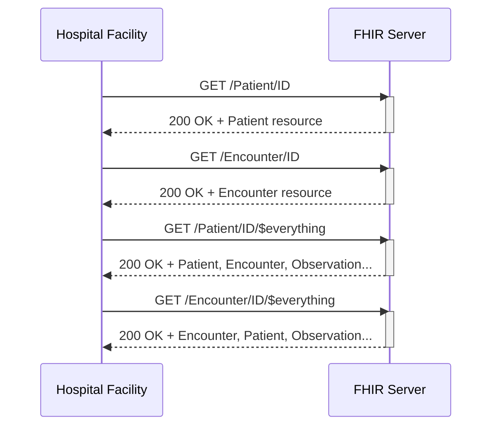

# Use Case #2

The patient, now in the care of EMS, is on the way to a hospital facility. This said, hospital facility needs to understand the full context of the incident and the patient’s initial condition. To ensure continuity of care, the hospital retrieves the patient’s shared record from the Shared Health Record (SHR). Use Case #2 covers the retrieval of the road safety case data bundle from the SHR by the hospital facility.

The PH Road Safety FHIR® Connectathon 2025 will use the **draft** [PH RS FHIR Implementation Guide](https://build.fhir.org/ig/UPM-NTHC/PH-RoadSafetyIG/) with references pointing to the **draft** [PH Core FHIR Implementation Guide](https://build.fhir.org/ig/UP-Manila-SILab/ph-core/index.html).

> [!CAUTION]
> **The PH Road Safety FHIR IG and PH Core FHIR IG are made available for this track in initial draft forms with limited resources - The IGs are not suitable for production use or advanced testing.**

## Servers available for testing

Server |  Version | Name | Endpoint
|-------|-------|------|---------|
HAPI FHIR Server|FHIR R4 | FHIRLab | https://cdr.fhirlab.net/fhir 
Terminology Server|FHIR R4 | Ontoserver | https://tx.fhirlab.net/fhir 

Note: FHIRLab is an open interoperability sandbox. FHIR server in FHIRLab will remain accessible for testing and on-going learning activities post connectathon.

## Additional tools provided for connectathon

The tools below allow you to perform experimentation immediately and interact with others. They are the preferred method of exploring FHIR at the connectathon.

- [Postman Collection](../postman-collection/) 
- [FHIR validator](https://validator.fhirlab.net)

## Activity 2: Retrieve EMS FHIR Resources from the Shared Health Record (Use Case #2)
| Step | Activity                                       | Notes                                                                 | 
|------|------------------------------------------------|-----------------------------------------------------------------------|
| 1    | Review Road Safety FHIR IG Resources           | Refer to Resource Profiles found on the [Road Safety FHIR IG Artifacts](https://github.com/UP-Manila-SILab/PH-RoadSafetyIG).|
| 2    | Recall the EMS bundle resource `IDs`           | Patient logical ID was created after the bundle resource was successfully posted.|
| 3    | Setup access to test FHIR server               | Refer to the environment under the [Postman Collection](../postman-collection) folder.|
| 4    | Get EMS bundle `Patient` resource data         | In postman, use the syntax GET `{{fhir}}/Patient/ID`                          |
| 5    | Get EMS bundle `Encounter` resource data       | In postman, use the syntax GET `{{fhir}}/Encounter/ID`                        |
| 6    | Get $everything about the patient              | In postman, use the syntax GET `{{fhir}}/Patient/ID/$everything`              | 
| 7    | Get $everything from an encounter              | In postman, use the syntax GET `{{fhir}}/Encounter/ID/$everything`            |     

### Use Case Success
- Server returns HTTP `200 OK`. 
- GET `Patient` and `Encounter`: Transaction response shows details about the patient and encounter.
- GET $everything using `Patient` ID: Transaction response shows all FHIR resources submitted related to patient such as `Observation`, `Patient`, `Encounter`... 
- GET $everything from an `Encounter`: Transanction response shows all FHIR resources related to the encounter.

### Sequence Diagram

For a more detailed overview of the acceptance criteria of Use Case #2, please refer to the PH RS Acceptance Criteria Google Sheet.

👉 [Click for details on the Acceptance Criteria of Use Case #2](https://docs.google.com/spreadsheets/d/1YOYHxm9gU2V4fiAoLIVBWDrbZdsakTPHWAWg--DKrsA/)

## Assumptions

Assumption | Details
|----------|-------------|
Non FHIR National Codes | For [Philippine Standard Geographic Code (PSGC)](https://psa.gov.ph/classification/psgc) and [National Health Facility Registry (NHFR)](https://nhfr.doh.gov.ph/VActivefacilitiesList), please refer to respective websites for more details on getting their standard codes.
Storage of Codes | It is recommended for this event for your application to store your copy of the PSGC and NHFR codes.

## Supplementary guides for local testing

- [Starting a HAPI server - `FHIR CLI`](https://hapifhir.io/hapi-fhir/docs/tools/hapi_fhir_cli.html#server-run-server)
- [Uploading FHIR IGs - `UploadFIG`](https://github.com/brianpos/UploadFIG#user-content-running-the-utility)
- [Uploading Resources - `Postman local app`](https://www.postman.com/downloads/)
- [Validating Resources - `FHIR validator`](https://confluence.hl7.org/spaces/FHIR/pages/35718580/Using+the+FHIR+Validator)

