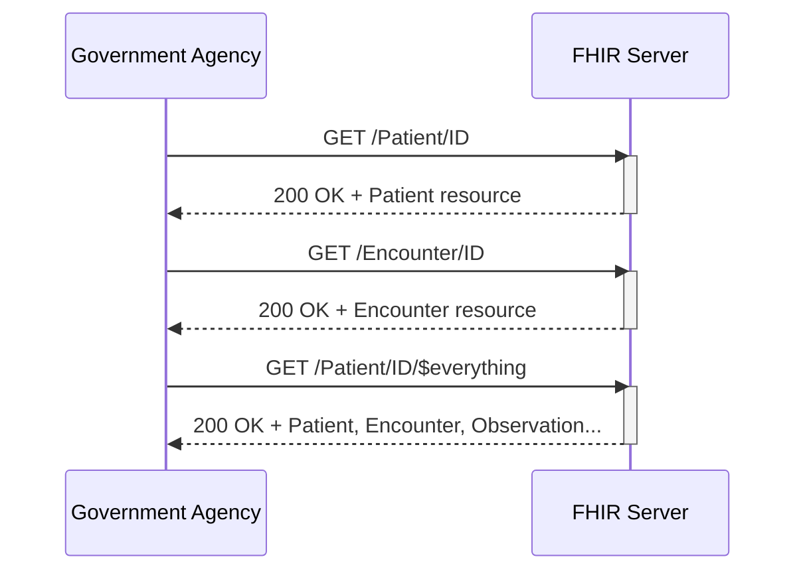

# Use Case #4

Government agencies retrieve road safety case data from the SHR to support post-incident investigation, reporting, and policy analysis. Use Case #4 covers the GET request for relevant case data from the SHR.

The PH Road Safety FHIR® Connectathon 2025 will use the **draft** [PH RS FHIR Implementation Guide](https://build.fhir.org/ig/UPM-NTHC/PH-RoadSafetyIG/) with references pointing to the **draft** [PH Core FHIR Implementation Guide](https://build.fhir.org/ig/UP-Manila-SILab/ph-core/index.html).

> [!CAUTION]
> **The PH Road Safety FHIR IG and PH Core FHIR IG are made available for this track in initial draft forms with limited resources - The IGs are not suitable for production use or advanced testing.**

## Servers available for testing

Server |  Version | Name | Endpoint
|-------|-------|------|---------|
HAPI FHIR Server|FHIR R4 | FHIRLab | https://cdr.fhirlab.net/fhir 
Terminology Server|FHIR R4 | Ontoserver | https://tx.fhirlab.net/fhir 

Note: FHIRLab is an open interoperability sandbox. FHIR server in FHIRLab will remain accessible for testing and on-going learning activities post connectathon.

## Additional tools provided for connectathon

The tools below allow you to perform experimentation immediately and interact with others. They are the preferred method of exploring FHIR at the connectathon.

- [Postman Collection](../postman-collection/) 
- [FHIR validator](https://validator.fhirlab.net)

## Activity 1: Utilize the Terminology Server and Retrieve Value Set Codes

| Step | Activity                                       | Notes                                                                 | 
|------|------------------------------------------------|-----------------------------------------------------------------------|
| 1    | Review Immunization FHIR IG Value Sets         | Official URL of Value Sets can be found on the [Immunization FHIR IG Artifacts](https://build.fhir.org/ig/UP-Manila-SILab/immunizationfhirig/artifacts.html).                       |
| 2    | Setup access to test FHIR server               | Refer to the environment under the [Postman Collection](../postman-collection) folder. |
| 3    | Get `Administrative Gender` Value Set           | This is a required Value Set in FHIR which can be found on the [PH Core Patient](https://build.fhir.org/ig/UP-Manila-SILab/ph-core/StructureDefinition-ph-core-patient.html) resource.|
| 4    | Get `Vaccine Brand Name` Value Set             | $expand can be used to display Value Set codes.|
| 5    | Get `Vaccine Generic Name` Value Set           | $expand can be used to display Value Set codes.|
| 6    | Get `Action Taken` Value Set                    | $expand can be used to display Value Set codes.|
| 7    | Get `Action Reason` Value Set                   | $expand can be used to display Value Set codes.|
| 8    | Get `Vaccination Encounter Type` Value Set      | $expand can be used to display Value Set codes.|

### Use Case Success
Server returns HTTP 200 OK with full Value Set response.

### Sequence Diagram

### Acceptance Criteria
For a more detailed overview of the acceptance criteria of Use Case #4, please refer to the PH RS Acceptance Criteria Google Sheet.

👉 [Click for details on the Acceptance Criteria of Use Case #4](https://docs.google.com/spreadsheets/d/1YOYHxm9gU2V4fiAoLIVBWDrbZdsakTPHWAWg--DKrsA/)

## Assumptions

Assumption | Details
|----------|-------------|
Non FHIR National Codes | For [Philippine Standard Geographic Code (PSGC)](https://psa.gov.ph/classification/psgc) and [National Health Facility Registry (NHFR)](https://nhfr.doh.gov.ph/VActivefacilitiesList), please refer to respective websites for more details on getting their standard codes.
Storage of Codes | It is recommended for this event for your application to store your copy of the PSGC and NHFR codes.

## Supplementary guides for local testing

- [Starting a HAPI server - `FHIR CLI`](https://hapifhir.io/hapi-fhir/docs/tools/hapi_fhir_cli.html#server-run-server)
- [Uploading FHIR IGs - `UploadFIG`](https://github.com/brianpos/UploadFIG#user-content-running-the-utility)
- [Uploading Resources - `Postman local app`](https://www.postman.com/downloads/)
- [Validating Resources - `FHIR validator`](https://confluence.hl7.org/spaces/FHIR/pages/35718580/Using+the+FHIR+Validator)

