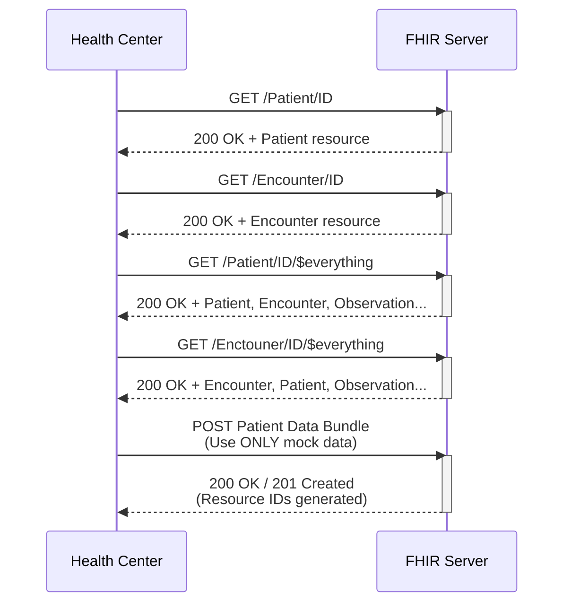

# Use Case #5

After the acute phase of the incident has passed, the health center or local primary care provider may need to conduct patient follow-ups—such as wound checks, rehabilitation tracking, or monitoring long-term outcomes. To ensure that this follow-up care is accurate, the health center first retrieves the patient’s road safety case from the Shared Health Record (SHR). Based on the retrieved information, the health center performs the necessary follow-up assessment and must then submit updated information back to the SHR.
Use Case #5 includes both the retrieval (GET) and follow-up submission (POST) of road safety case data to the SHR by the health center.

The PH Road Safety FHIR® Connectathon 2025 will use the **draft** [PH RS FHIR Implementation Guide](https://build.fhir.org/ig/UPM-NTHC/PH-RoadSafetyIG/) with references pointing to the **draft** [PH Core FHIR Implementation Guide](https://build.fhir.org/ig/UP-Manila-SILab/ph-core/index.html).

> [!CAUTION]
> **The PH Road Safety FHIR IG and PH Core FHIR IG are made available for this track in initial draft forms with limited resources - The IGs are not suitable for production use or advanced testing.**

## Servers available for testing

Server |  Version | Name | Endpoint
|-------|-------|------|---------|
HAPI FHIR Server|FHIR R4 | FHIRLab | https://cdr.fhirlab.net/fhir 
Terminology Server|FHIR R4 | Ontoserver | https://tx.fhirlab.net/fhir 

Note: FHIRLab is an open interoperability sandbox. FHIR server in FHIRLab will remain accessible for testing and on-going learning activities post connectathon.

## Additional tools provided for connectathon

The tools below allow you to perform experimentation immediately and interact with others. They are the preferred method of exploring FHIR at the connectathon.

- [Postman Collection](../postman-collection/) 
- [FHIR validator](https://validator.fhirlab.net)

## Activity 5: Retrieve patient records for follow-up and submit to the Shared Health Records (Use Case #5)
| Step | Activity                                       | Notes                                                                 | 
|------|------------------------------------------------|-----------------------------------------------------------------------|
| 1    | Review Road Safety FHIR IG Resources           | Refer to Resource Profiles found on the [Road Safety FHIR IG Artifacts](https://github.com/UP-Manila-SILab/PH-RoadSafetyIG).|
| 2    | Recall the Facility bundle resource `IDs`      | Patient logical ID was created after the bundle resource was successfully posted.|
| 3    | Setup access to test FHIR server               | Refer to the environment under the [Postman Collection](../postman-collection) folder.|
| 4    | Get EMS bundle `Patient` resource data         | In postman, use the syntax GET `{{fhir}}/Patient/ID`                          |
| 5    | Get EMS bundle `Encounter` resource data       | In postman, use the syntax GET `{{fhir}}/Encounter/ID`                        |
| 6    | Get $everything about the patient              | In postman, use the syntax GET `{{fhir}}/Patient/ID/$everything`              | 
| 7    | Get $everything from an encounter              | In postman, use the syntax GET `{{fhir}}/Encounter/ID/$everything`            | 
| 7    | Create a Resource `Bundle` for the patient     | A bundle is a container for a collection of resources. Use provided examples. |
| 8    | `$validate` the Resource Bundle                | Resources can be validated through Postman (tx endpoint) or through hosted FHIR validators. | 
| 9    | Submit `Bundle` to the SHR                     | Use the FHIRLab `HAPI FHIR` Endpoint https://cdr.fhirlab.net/fhir |

### Use Case Success
- After GET, server returns HTTP `200 OK`. 
- GET `Patient` and `Encounter`: Transaction response shows details about the patient and encounter.
- GET $everything using `Patient` ID: Transaction response shows all FHIR resources submitted related to patient such as `Observation`, `Patient`, `Encounter`... 
- After POST, server returns HTTP `200 OK`. 
- Transaction response also shows that resources were `201 Created` (with generated resource IDs). 

### Sequence Diagram

### Acceptance Criteria
For a more detailed overview of the acceptance criteria of Use Case #5, please refer to the PH RS Acceptance Criteria Google Sheet.

👉 [Click for details on the Acceptance Criteria of Use Case #5](https://docs.google.com/spreadsheets/d/1YOYHxm9gU2V4fiAoLIVBWDrbZdsakTPHWAWg--DKrsA/)

## Assumptions

Assumption | Details
|----------|-------------|
Non FHIR National Codes | For [Philippine Standard Geographic Code (PSGC)](https://psa.gov.ph/classification/psgc) and [National Health Facility Registry (NHFR)](https://nhfr.doh.gov.ph/VActivefacilitiesList), please refer to respective websites for more details on getting their standard codes.
Storage of Codes | It is recommended for this event for your application to store your copy of the PSGC and NHFR codes.

## Supplementary guides for local testing

- [Starting a HAPI server - `FHIR CLI`](https://hapifhir.io/hapi-fhir/docs/tools/hapi_fhir_cli.html#server-run-server)
- [Uploading FHIR IGs - `UploadFIG`](https://github.com/brianpos/UploadFIG#user-content-running-the-utility)
- [Uploading Resources - `Postman local app`](https://www.postman.com/downloads/)
- [Validating Resources - `FHIR validator`](https://confluence.hl7.org/spaces/FHIR/pages/35718580/Using+the+FHIR+Validator)

